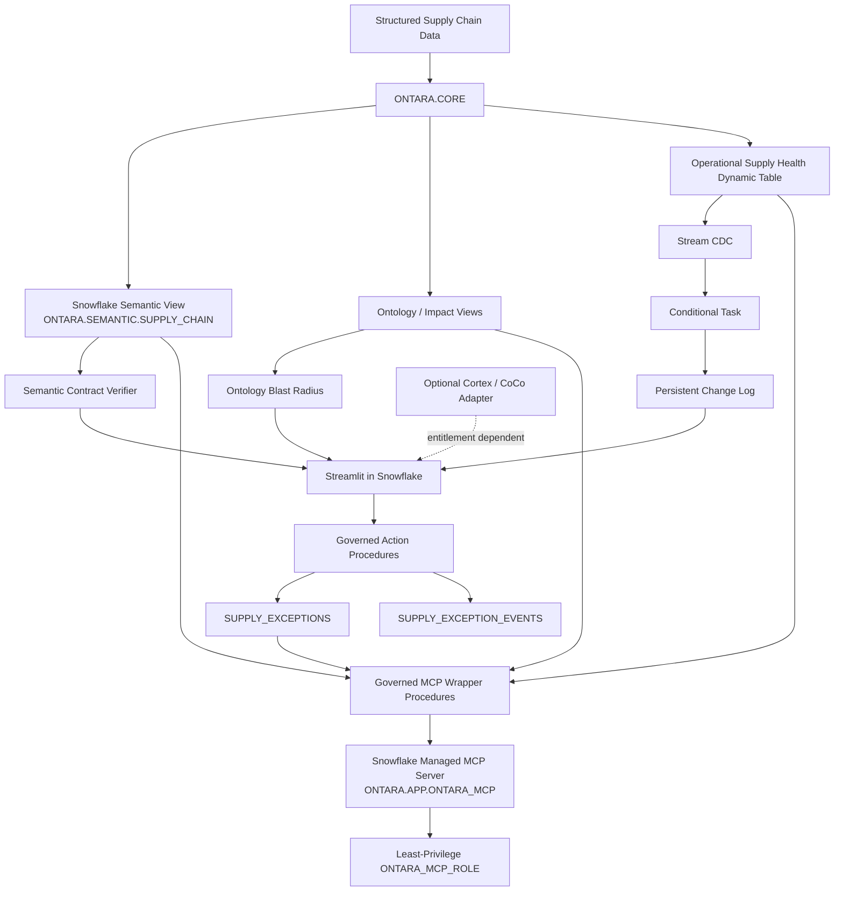

# Ontara — Governed Supply Chain Intelligence

> **One supply chain. Shared definitions. Trusted answers.**

Ontara is a Snowflake-native governed supply chain intelligence system for planning, procurement, logistics, and operations teams. It addresses a common enterprise failure mode: different teams ask equivalent supply-chain questions but receive different definitions, different numbers, and recommendations that are difficult to audit or safely operationalize.

Ontara establishes a shared semantic contract, models downstream supply-chain relationships as an ontology, quantifies disruption blast radius, and turns high-risk findings into approval-gated operational actions with persisted Snowflake audit history.

---

## Live assets

- **Live Streamlit app:** https://app.snowflake.com/OIVNDBA/yl85787/#/streamlit-apps/ONTARA.APP.ONTARA_APP
- **Public repository:** https://github.com/Rahul9214/ontara
- **Hackathon challenge:** Supply Chain Ontology and Governed Conversational Analytics
- **Team:** Ontara
- **Team lead:** Rahul Ranjan
- **Team size:** 1

---

## Why Ontara

Supply-chain decision making is often slowed by three problems:

1. **Metric inconsistency** — Planning, procurement, and logistics teams use different wording and sometimes different formulas for the same KPI.
2. **Fragmented impact analysis** — Supplier disruption must be manually traced across parts, plants, shipments, orders, customers, inventory, revenue, and alternate sourcing.
3. **Unsafe automation** — Analytical recommendations can be disconnected from governance, approval, auditability, and operational state transitions.

Ontara addresses all three through one governed Snowflake architecture.

---

# Three differentiators

## 1. Semantic Contract Verifier

Ontara defines canonical metrics through a Snowflake Semantic View and treats the metric definition as a governed contract rather than a dashboard-specific calculation.

Equivalent persona questions resolve to the same semantic metric and result.

### Canonical metrics

| Metric | Governed value | Contract |
|---|---:|---|
| On-Time Delivery | **89.473684%** | `OTD_V1` |
| Fill Rate | **91.954948%** | `FILL_RATE_V1` |
| Days of Inventory | **16.253551 days** | `DOI_V1` |
| Landed Cost / Unit | **$65.66857888** | `LANDED_COST_V1` |

The product surfaces the definition, contract version, semantic source, filters, and result so a user can understand **why** an answer is trusted.

---

## 2. Quantitative Ontology Blast Radius

Ontara models downstream impact as:

```text
Supplier -> Part -> Plant -> Shipment -> Order -> Customer
```

For the controlled disrupted supplier `SUP-003` / **Orion Precision**, Ontara calculates:

- affected parts: **3**
- affected plants: **3**
- affected orders: **12**
- affected customers: **6**
- strategic customers affected: **2**
- affected order units: **1,410**
- outstanding units: **235**
- total order value exposed: **$231,453.99**
- outstanding revenue exposure: **$36,024.90**
- inventory shortfall: **15 units**
- lowest Days of Inventory: **0.42**
- logistics-risk orders: **1**
- maximum impact risk score: **90 / CRITICAL**
- recommended response: **ESCALATE_AND_EXPEDITE**

A controlled critical path is also visible end to end:

```text
SUP-003 -> PRT-009 -> PLT-003 -> ORD-008 -> CUS-003
```

with 60 outstanding units, $13,187.40 revenue exposure, 5 available inventory units, 20 safety-stock units, 15-unit shortfall, 0.42 DOI, and an alternate-source option.

---

## 3. Governed Action Loop

Ontara deliberately separates **analysis** from **execution**.

A disruption can create a governed mitigation request, but the requester cannot approve its own action through the MCP surface. Human approval remains explicit.

Workflow:

```text
Detect / Explain
      ↓
Recommend
      ↓
Request mitigation
      ↓
PENDING_APPROVAL
      ↓
Human approve / reject
      ↓
IN_PROGRESS
      ↓
RESOLVED
      ↓
Persisted audit history
```

Every transition is persisted with actor, event type, prior state, next state, note, timestamp, and payload.

---

# Architecture



## Runtime architecture

```text
Streamlit UI
   |
   v
Governed Application Layer
   |
   +--> Verified deterministic query path  [LIVE]
   |       |
   |       +--> Semantic View
   |       +--> Ontology impact views
   |       +--> Operational health
   |       +--> Governed action procedures
   |
   +--> Cortex / CoCo intelligence adapter [OPTIONAL / entitlement dependent]
```

The business-truth path does not depend on an LLM. If the optional intelligence layer is unavailable, Ontara fails closed to deterministic governed capabilities rather than fabricating an answer.

---

# Snowflake-native implementation

## Data model

Core entities include:

- Supplier
- Supplier-Part relationship
- Part
- Plant
- Shipment
- Shipment Event
- Purchase Order
- Customer Order
- Customer
- Inventory Snapshot
- Supply Exception
- Supply Exception Event

## Snowflake objects used

- **Semantic Views** — canonical metrics and governed business definitions
- **Dynamic Tables** — incremental operational supply-health materialization
- **Streams** — CDC over operational health changes
- **Tasks** — conditional change processing
- **Stored Procedures** — governed request, approval, and status workflows
- **Streamlit in Snowflake** — product UI
- **Snowflake-managed MCP** — scoped external tool surface
- **RBAC** — least-privilege MCP role and controlled object access
- **Snowflake CLI** — reproducible deployment and validation

---

# Operational change pipeline

Ontara includes a real Snowflake change pipeline:

```text
CORE operational source
      ↓
INCREMENTAL Dynamic Table
      ↓
Stream CDC
      ↓
Conditional Task
      ↓
Persistent change log
```

A controlled validation changed `PRT-009 / PLT-003` inventory from 30 to 50 on-hand units, then observed:

- available inventory: **5 -> 25**
- shortfall: **15 -> 0**
- DOI: **0.42 -> 2.08**
- risk score: **90 -> 75**
- operational health: **CRITICAL -> AT_RISK**
- recommendation: **ESCALATE_AND_EXPEDITE -> MITIGATE_AND_MONITOR**

The source was then restored to baseline. Reverse CDC was captured and the stream returned to an empty state.

Permanent validation confirms:

- source baseline restored
- governed baseline restored
- stream empty after round trip
- persisted CDC history present
- controlled path includes both states
- task execution succeeded

---

# Governed MCP surface

Snowflake-managed MCP server:

```text
ONTARA.APP.ONTARA_MCP
```

Exposed tools:

1. `get_governed_metric`
2. `get_supplier_blast_radius`
3. `get_operational_health`
4. `get_supply_exception`
5. `request_supply_exception`

Explicitly **not exposed**:

- arbitrary SQL
- `SYSTEM_EXECUTE_SQL`
- approve / reject operations
- arbitrary status-transition operations

This keeps investigation and request creation available while preserving human approval.

## Least-privilege role

`ONTARA_MCP_ROLE` receives only the privileges required to:

- use `ONTARA_WH`
- use database `ONTARA`
- use schema `ONTARA.APP`
- use `ONTARA.APP.ONTARA_MCP`
- invoke the five MCP wrapper procedures

It has no direct grants on `RAW`, `CORE`, `SEMANTIC`, or `GOVERNANCE`, and no access to approval/status-transition procedures.

---

# Product surfaces

The Snowflake-native Streamlit app includes:

### Executive Overview
At-a-glance canonical KPIs and high-risk supplier context.

### Ask Ontara
Verified deterministic question routing for supported governed intents.

### Semantic Contract Verifier
Demonstrates that equivalent persona wording resolves to the same metric contract.

### Ontology Blast Radius
Quantifies downstream supplier impact across the ontology.

### Governed Action Center
Creates, approves, progresses, resolves, and audits mitigation actions.

### Trust & Governance
Explains semantic contracts, source objects, deterministic fallback, and governance controls.

---

# Repository structure

```text
ontara/
├── streamlit_app.py
├── ontara_app/
│   ├── config.py
│   ├── routing.py
│   ├── data.py
│   ├── components.py
│   └── views.py
├── sql/
│   ├── 00_bootstrap.sql
│   ├── 05_semantic_view.sql
│   ├── 06_validate_semantic.sql
│   ├── 07_*.sql / 08_*.sql
│   ├── 10_validate_governed_action_loop.sql
│   ├── 11_operational_supply_health.sql
│   ├── 12_operational_change_pipeline.sql
│   ├── 13_validate_operational_change_pipeline.sql
│   ├── 14_mcp_governed_tools.sql
│   ├── 15_mcp_server.sql
│   ├── 16_mcp_access_control.sql
│   └── 17_validate_mcp_governance.sql
├── docs/
│   ├── semantic-contract.md
│   ├── cortex-coco-fallback.md
│   ├── coco-evidence.md
│   └── mcp-governance.md
├── tests/
├── environment.yml
├── snowflake.yml
└── README.md
```

---

# Validation and quality gates

Key validation suites include:

- semantic contract validation
- ontology blast-radius validation
- governed action-loop validation
- operational change-pipeline validation
- MCP governance validation
- Python unit tests
- Ruff linting
- `git diff --check`

The project uses feature branches, pull requests, CI, and squash merges.

---

# Security and governance principles

Ontara is intentionally designed around controlled capability boundaries:

- parameterized / allowlisted operations
- no arbitrary SQL through MCP
- explicit human approval before governed execution
- actor and status history persisted
- semantic contract provenance exposed
- least-privilege role for external tool access
- deterministic fallback rather than fabricated AI output
- no secrets committed to source control

---

# CoCo / Cortex transparency

The event Snowflake account encountered a Cortex / CoCo capability entitlement limitation even after required role and account configuration was applied.

Following organizer guidance, Ontara separates optional intelligence from core governed execution:

```text
UI -> governed application layer -> deterministic Snowflake truth path [LIVE]
                                -> optional Cortex / CoCo adapter [ENTITLEMENT DEPENDENT]
```

No unavailable CoCo or Cortex response is represented as live execution.

The product therefore remains fully demonstrable through real Snowflake SQL, Semantic Views, Dynamic Tables, Streams, Tasks, stored procedures, Streamlit, governed MCP objects, RBAC, and audit workflows.

---

# Demo path

A concise judge walkthrough:

1. **Executive Overview** — establish governed KPI truth.
2. **Semantic Contract Verifier** — show equivalent questions resolving to one contract.
3. **Ontology Blast Radius** — open `SUP-003` and inspect downstream exposure.
4. **Governed Action Center** — show request -> approval -> execution -> audit history.
5. **Trust & Governance** — explain deterministic fallback and capability boundaries.
6. **Architecture / repo** — show Dynamic Table + Stream + Task + managed MCP objects.

---

# Impact

Ontara reduces the amount of manual reconciliation required during disruption analysis by centralizing definitions, impact logic, operational state, and audit history in Snowflake.

The architecture can scale by adding:

- new semantic contracts
- additional ontology paths
- supplier scorecards
- demand forecast signals
- additional Dynamic Table materializations
- more governed MCP wrappers
- optional Cortex / CoCo capabilities when entitlement is available

without changing the core governance model.

---

## Final principle

**Ontara does not optimize for the fastest answer. It optimizes for the fastest answer that the organization can trust, explain, approve, and audit.**
